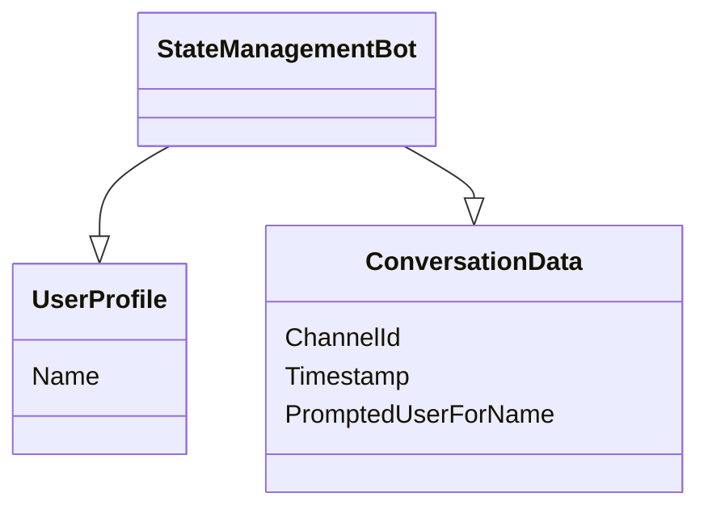
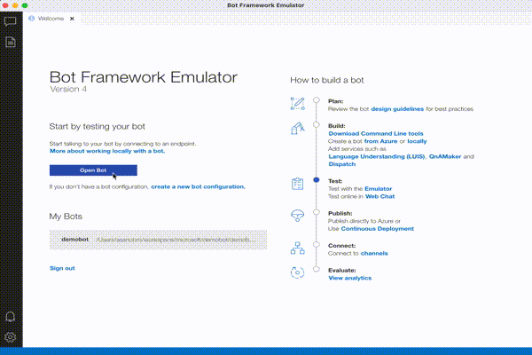

# Save user and conversation data

> A bot is inherently stateless. Once your bot is deployed,
> it may not run in the same process or on the same machine from one turn to the next.
> However, your bot may need to track the context of a conversation
> so that it can manage its behavior and remember answers to previous questions.
> The state and storage features of the Bot Framework SDK allow you to add state
> to your bot. Bots use state management and storage objects to manage and persist state.
> The state manager provides an abstraction layer that lets you access state
> properties using property accessors, independent of the type of underlying storage.
> [Microsoft documents](https://docs.microsoft.com/en-us/azure/bot-service/bot-builder-howto-v4-state?view=azure-bot-service-4.0&tabs=csharp#prerequisites)

## Struct

## Goals

